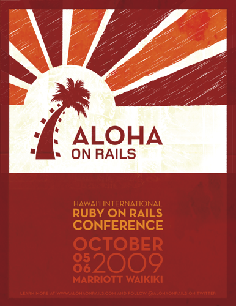
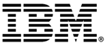

!SLIDE centereverything

<table><tr><td>

</td><td>

</td></tr></table>
## Aloha on Rails
# Ruby on Rails Workshop
### October 3rd, 2009
#####wireless: rails3 - no pwd
#####hashtag: #alohaonrails

!SLIDE

# Open source workshop
* Community project
  * Many individuals 
  * RailsBridge
  * DevChix
* Open materials
  * Workshop planning: DevChix wiki
  * Slides: github, slidedown

!SLIDE

!SLIDE
# Format

!SLIDE

# What is Ruby on Rails?

!SLIDE centereverything

!SLIDE

<table width="100%">
<tr>
<td align="center">

</td>
<td align="center">

</td>
</tr>
<tr>
<td>&nbsp;</td>
<td>&nbsp;</td>
</tr>
</table>
# &nbsp;
# &nbsp;

!SLIDE

<table width="100%">
<tr>
<td align="center">

</td>
<td align="center">

</td>
</tr>
<tr>
<td align="center">
Language
</td>
<td align="center">
Framework
</td>
</tr>
</table>
# &nbsp;
# &nbsp;

!SLIDE

## Ruby: programming language
* Object oriented
* General purpose

## Rails: web application framework
* Database agnostic
* Open source
* History: 37signals

!SLIDE
# The Rails Philosophy
* Opinionated
* Convention over configuration
* DRY (Don't Repeat Yourself)
    * less code means it's easier to maintain & modify
* Test Driven Development (TDD)
* Minimal code - maximal effect

!SLIDE
# Agile development

* Pair programming
* Test-driven or Behavior-driven development

!SLIDE
# Goal
* By the end of the day, you will have built and deployed a web application live on the internet

!SLIDE
# Tools we'll be working with
* **rails**
* **rake**: like make for ruby, easy way to run tasks
* **git**: for source code control
* **database**: we'll use sqlite, but could be any relational database 
* **editor**
* **heroku**: free rails hosting

!SLIDE
# Today's project

!SLIDE 
# Schedule
* 9:00-9:30 sign in, breakfast
* 9:30-10:00 intro
* 10:00-10:50 session 1
* 11:00-11:50 session 2
* 12:00-1:00 lunch out
* 1:00-1:50 session 3
* 2:00-2:50 session 4
* 3:00-4:00 wrap up; final questions
