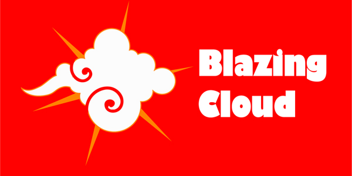

!SLIDE centereverything

## SF Ruby Meetup 
# Ruby on Rails Workshop
### February 27th, 2010
#####wireless: 
#####hashtag: #sfruby

!SLIDE

## Open source workshop
* Community project
  * Many individuals 
  * RailsBridge
  * DevChix
* Open materials
  * Workshop planning: DevChix wiki
  * Slides: github, slidedown
  * github.com/railsbridge

!SLIDE
 
&nbsp;&nbsp;
 
&nbsp;&nbsp;

!SLIDE

# Why are we here?

!SLIDE

# What is Ruby on Rails?

!SLIDE centereverything

!SLIDE

<table width="100%">
<tr>
<td align="center">

</td>
<td align="center">

</td>
</tr>
<tr>
<td>&nbsp;</td>
<td>&nbsp;</td>
</tr>
</table>
# &nbsp;
# &nbsp;

!SLIDE

<table width="100%">
<tr>
<td align="center">

</td>
<td align="center">

</td>
</tr>
<tr>
<td align="center">
Language
</td>
<td align="center">
Framework
</td>
</tr>
</table>
# &nbsp;
# &nbsp;

!SLIDE

## Ruby: programming language
* Object oriented
* General purpose

!SLIDE

## Rails: web application framework
* Database agnostic
* Built using the Ruby Language
* History
  * 37signals 
  * 2004 - first released as open source
  * 2007 - shipped with Mac OS 10.5 "Leopard"

!SLIDE

!SLIDE
## The Rails Philosophy
* Opinionated
* Convention over configuration
* DRY (Don't Repeat Yourself)
  * less code means it's easier to maintain & modify
* Test Driven Development (TDD)
* Minimal code - maximal effect

!SLIDE
## Agile development

* Pair programming
* Test-driven or Behavior-driven development

!SLIDE
## Goal
* By the end of the day, you will have built and deployed a web application live on the internet

!SLIDE
## Tools we'll be working with
* **rails**
* **rake**: like make for Ruby. An easy way to run tasks.
* **git**: source code control.
* **database**: we'll use SQLite, but could be any relational database.
* **editor**: KomodoEdit.
* **heroku**: free Rails hosting.

!SLIDE
## Today's project

!SLIDE 
## Schedule
* 9:30-10:00 Sign in, get coffee
* 10:00-10:30 Intro
* 10:30-11:20 Part 1: Ruby bootcamp
* 11:30-12:20 Part 2: Creating the app
* 12:30-1:30 Lunch (Mediterranean)
* 1:30-2:20 Part 3: Associations
* 2:30-3:20 Part 4: Authentication
* 3:30-4:00 Wrap up & final questions
* 4:30-?? Afterparty @ Thirsty Bear
